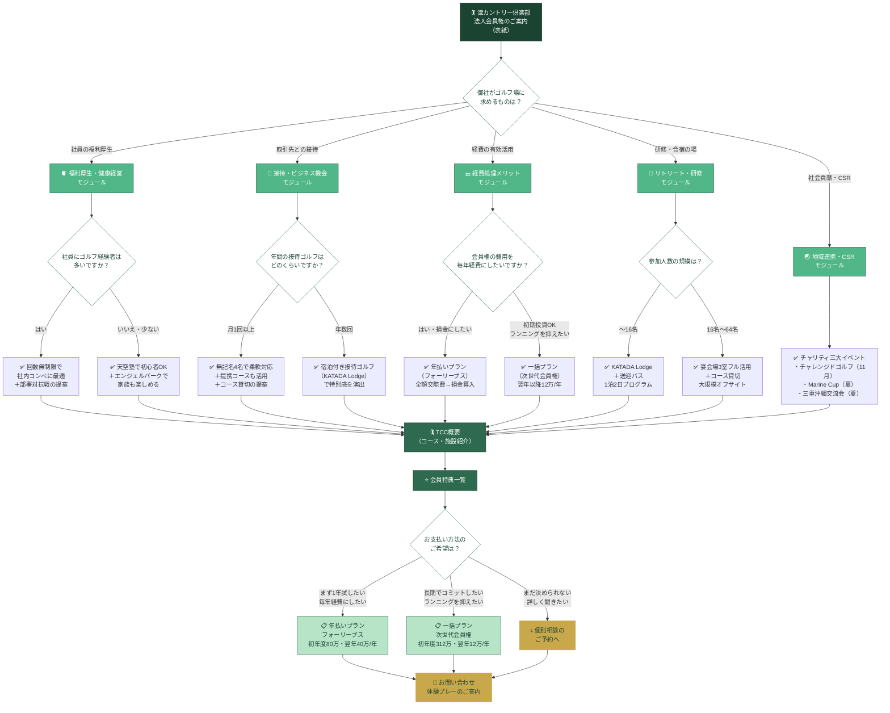

```mermaid
flowchart TD
    START["🏌️ 津カントリー倶楽部\n法人会員権のご案内\n（表紙）"]
    START --> Q1

    Q1{"御社がゴルフ場に\n求めるものは？"}
    Q1 -->|"社員の福利厚生"| MOD_A["🫀 福利厚生・健康経営\nモジュール"]
    Q1 -->|"取引先との接待"| MOD_B["🤝 接待・ビジネス機会\nモジュール"]
    Q1 -->|"経費の有効活用"| MOD_C["💴 経費処理メリット\nモジュール"]
    Q1 -->|"研修・合宿の場"| MOD_D["🏨 リトリート・研修\nモジュール"]
    Q1 -->|"社会貢献・CSR"| MOD_E["🌏 地域連携・CSR\nモジュール"]
    
    MOD_A --> Q2A{"社員にゴルフ経験者は\n多いですか？"}
    Q2A -->|"はい"| A_EXP["✅ 回数無制限で\n社内コンペに最適\n＋部署対抗戦の提案"]
    Q2A -->|"いいえ・少ない"| A_BEG["✅ 天空塾で初心者OK\n＋エンジェルパークで\n家族も楽しめる"]
    
    MOD_B --> Q2B{"年間の接待ゴルフは\nどのくらいですか？"}
    Q2B -->|"月1回以上"| B_FREQ["✅ 無記名4名で柔軟対応\n＋提携コースも活用\n＋コース貸切の提案"]
    Q2B -->|"年数回"| B_OCC["✅ 宿泊付き接待ゴルフ\n（KATADA Lodge）\nで特別感を演出"]
    
    MOD_C --> Q2C{"会員権の費用を\n毎年経費にしたいですか？"}
    Q2C -->|"はい・損金にしたい"| C_FOUR["✅ 年払いプラン\n（フォーリーブス）\n全額交際費→損金算入"]
    Q2C -->|"初期投資OK\nランニングを抑えたい"| C_NEXT["✅ 一括プラン\n（次世代会員権）\n翌年以降12万/年"]
    
    MOD_D --> Q2D{"参加人数の規模は？"}
    Q2D -->|"〜16名"| D_SMALL["✅ KATADA Lodge\n＋送迎バス\n1泊2日プログラム"]
    Q2D -->|"16名〜64名"| D_LARGE["✅ 宴会場3室フル活用\n＋コース貸切\n大規模オフサイト"]
    
    MOD_E --> CSR_DETAIL["✅ チャリティ三大イベント\n・チャレンジドゴルフ（11月）\n・Marine Cup（夏）\n・三重沖縄交流会（夏）"]
    
    A_EXP --> OVERVIEW["🏌️ TCC概要\n（コース・施設紹介）"]
    A_BEG --> OVERVIEW
    B_FREQ --> OVERVIEW
    B_OCC --> OVERVIEW
    C_FOUR --> OVERVIEW
    C_NEXT --> OVERVIEW
    D_SMALL --> OVERVIEW
    D_LARGE --> OVERVIEW
    CSR_DETAIL --> OVERVIEW
    
    OVERVIEW --> BENEFITS["⭐ 会員特典一覧"]
    
    BENEFITS --> Q_PLAN{"お支払い方法の\nご希望は？"}
    Q_PLAN -->|"まず1年試したい\n毎年経費にしたい"| PLAN_FOUR["📋 年払いプラン\nフォーリーブス\n初年度80万・翌年40万/年"]
    Q_PLAN -->|"長期でコミットしたい\nランニングを抑えたい"| PLAN_NEXT["📋 一括プラン\n次世代会員権\n初年度312万・翌年12万/年"]
    Q_PLAN -->|"まだ決められない\n詳しく聞きたい"| CTA_CONSULT["📞 個別相談の\nご予約へ"]
    
    PLAN_FOUR --> CTA["📩 お問い合わせ\n体験プレーのご案内"]
    PLAN_NEXT --> CTA
    CTA_CONSULT --> CTA
    
    style START fill:#1B4332,color:#fff,stroke:#1B4332
    style Q1 fill:#fff,stroke:#2D6A4F,color:#1B4332
    style Q2A fill:#fff,stroke:#2D6A4F,color:#1B4332
    style Q2B fill:#fff,stroke:#2D6A4F,color:#1B4332
    style Q2C fill:#fff,stroke:#2D6A4F,color:#1B4332
    style Q2D fill:#fff,stroke:#2D6A4F,color:#1B4332
    style Q_PLAN fill:#fff,stroke:#2D6A4F,color:#1B4332
    style MOD_A fill:#52B788,color:#fff,stroke:#2D6A4F
    style MOD_B fill:#52B788,color:#fff,stroke:#2D6A4F
    style MOD_C fill:#52B788,color:#fff,stroke:#2D6A4F
    style MOD_D fill:#52B788,color:#fff,stroke:#2D6A4F
    style MOD_E fill:#52B788,color:#fff,stroke:#2D6A4F
    style OVERVIEW fill:#2D6A4F,color:#fff,stroke:#1B4332
    style BENEFITS fill:#2D6A4F,color:#fff,stroke:#1B4332
    style CTA fill:#C9A84C,color:#1B4332,stroke:#C9A84C
    style CTA_CONSULT fill:#C9A84C,color:#1B4332,stroke:#C9A84C
    style PLAN_FOUR fill:#B7E4C7,color:#1B4332,stroke:#2D6A4F
    style PLAN_NEXT fill:#B7E4C7,color:#1B4332,stroke:#2D6A4F
```
